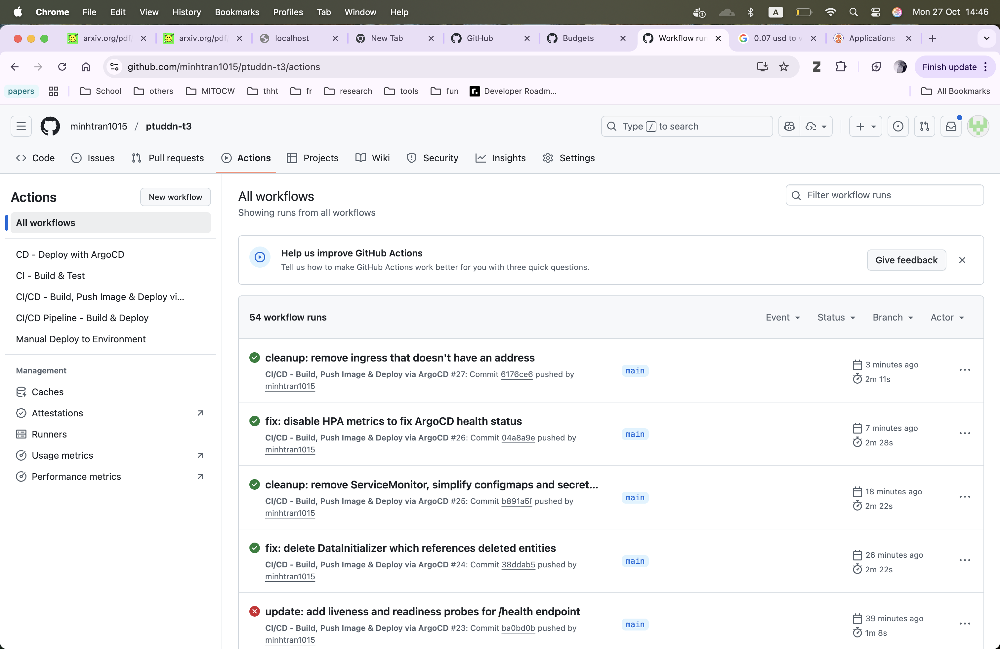

# GitHub Action + ArgoCD Setup Complete

The setup is successfully completed as shown in the screenshots below:

## Project Structure

- `demo/`: Spring Boot application source code
- `deployment/`: Kubernetes manifests, Helm charts, Docker files
- `docs/`: Documentation and setup guides
- `images/`: Screenshots and images
- `scripts/`: Build and deployment scripts

## Monitoring Setup

The application is monitored using Prometheus and Grafana.

### Accessing Monitoring Tools

- **Grafana**: <http://localhost:3000>
  - Username: admin
  - Password: (run `kubectl get secret --namespace monitoring monitoring-grafana -o jsonpath="{.data.admin-password}" | base64 --decode ; echo`)

- **Prometheus**: <http://localhost:9090>

### Application Metrics

The Spring Boot application exposes metrics at `/actuator/prometheus` (when actuator is enabled).

ServiceMonitor is configured to scrape metrics from the demo-app service.