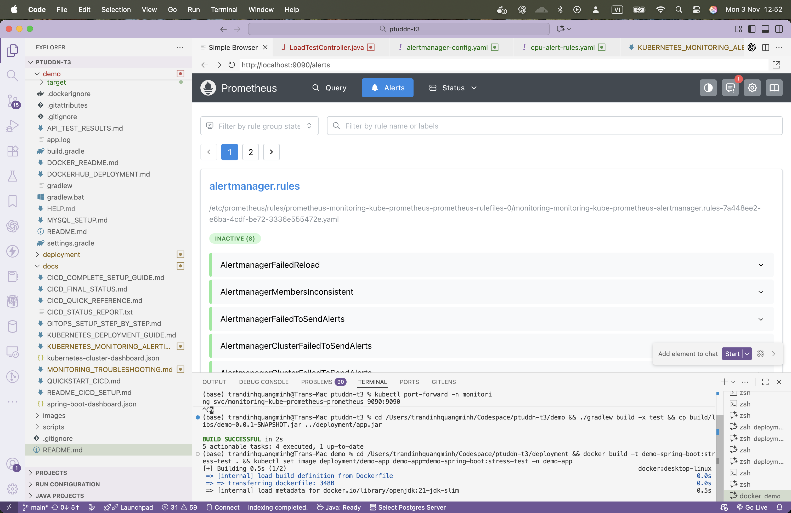
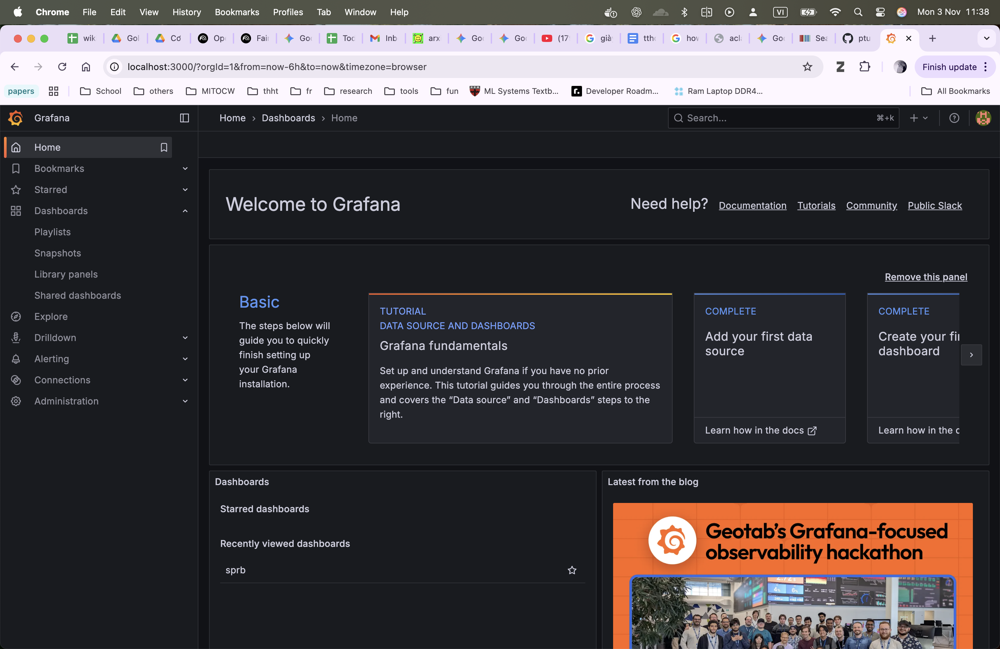
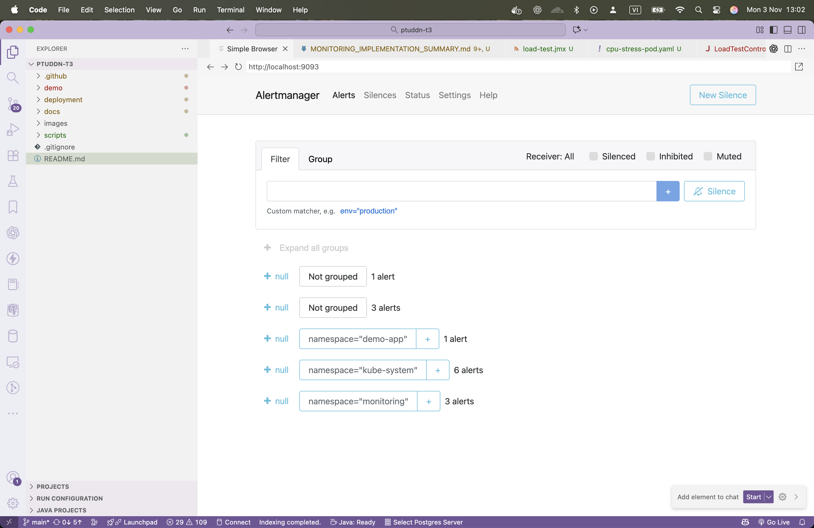

# PTUDDN Advanced Web Development Assignments

This repository contains assignments and projects for the PTUDDN course. It has expanded from its initial Week 3 scope to cover a comprehensive set of advanced topics, including:


## ✅ Completed Implementation

### 1. Application Deployment on Kubernetes

- Spring Boot 3.5.6 REST API deployed in `demo-app` namespace
- 3 replicas with load balancer service
- Graceful health checks and readiness probes
- Docker containerization with optimized multi-stage builds

### 2. Kubernetes Monitoring Stack

**Prometheus** - Metrics collection and alerting



**Grafana** - Visualization and dashboards



**AlertManager** - Alert routing and notifications



### 3. Alert Configuration

- ✅ CPU usage alerts (>80% for 1 minute)
- ✅ Memory exhaustion alerts (>90% for 2 minutes)
- ✅ Pod crash loop detection
- ✅ Node resource exhaustion monitoring
- ✅ Email and webhook notification channels

### 4. CI/CD Pipeline

**GitHub Actions** - Automated build and deployment


**ArgoCD** - GitOps continuous deployment


## Quick Start

### Build and Run

```bash
# Build the Docker image
cd demo
./gradlew build
docker build -t demo-app:latest .

# Deploy to Kubernetes
kubectl apply -f ../deployment/k8s/demo-app-deployment.yaml
kubectl apply -f ../deployment/k8s/demo-app-service.yaml

# Deploy monitoring stack (Prometheus + Grafana)
helm repo add prometheus-community https://prometheus-community.github.io/helm-charts
helm install kube-prometheus prometheus-community/kube-prometheus-stack -n monitoring --create-namespace

# Deploy AlertManager configuration
kubectl apply -f ../deployment/k8s/alertmanager-config.yaml
kubectl apply -f ../deployment/k8s/cpu-alert-rules.yaml
```

### Access Application & Monitoring Tools

#### Application API

```bash
# Get service IP
kubectl get svc -n demo-app demo-app

# Example request
curl -X POST http://localhost:8081/api/auth/login \
  -H "Content-Type: application/json" \
  -d '{"username":"admin","password":"admin123"}'
```

#### Grafana Dashboard (Monitoring)

- URL: <http://localhost:3000>
- Username: `admin`
- Default Password: (see secret in monitoring namespace)
- Features: Custom dashboards for pod/node metrics, real-time alerting visualization

#### Prometheus (Metrics Database)

- URL: <http://localhost:9090>
- Query metrics and check alert rules
- View active alerts and evaluation status

#### AlertManager (Alert Management)

- URL: <http://localhost:9093>
- View alerts by status, configure notification routes
- Test email/webhook notifications

## Project Structure

- `demo/`: Spring Boot application source code (Java 21)
- `deployment/`: Kubernetes manifests and Helm charts
  - `k8s/`: YAML configs for deployment, services, monitoring
  - `helm/`: Helm charts for application deployment
- `docs/`: Comprehensive documentation
  - `KUBERNETES_MONITORING_ALERTING.md`: Alert setup guide
  - `MONITORING_IMPLEMENTATION_SUMMARY.md`: Complete feature summary
- `images/`: Screenshots showing monitoring setup
- `scripts/`: Deployment and automation scripts

## Key Features

### Monitoring & Observability

- **Prometheus**: Scrapes metrics from Kubernetes nodes, pods, and containers
- **Grafana**: Pre-configured dashboards with CPU, memory, and network metrics
- **AlertManager**: Multi-channel notifications (email, webhooks, Slack)
- **PrometheusRules**: Automated alert generation for resource anomalies

### Alert Rules

The following alerts are automatically triggered:

1. **HighPodCPUUsage** - Pod CPU > 80% for 1 minute (Critical)
2. **HighNodeCPUUsage** - Node CPU > 80% for 1 minute (Warning)
3. **PodHighMemoryUsage** - Pod memory > 90% for 2 minutes (Warning)
4. **PodCrashLooping** - Pod restarts repeatedly (Critical)

Alerts are routed to configured notification channels for real-time incident response.

### Load Testing

JMeter configuration included for performance testing:

- 50 concurrent threads
- 10-second ramp-up
- 180-second test duration
- Response time and throughput analysis

Run tests: `jmeter -n -t ../scripts/load-test.jmx -l results.jtl`

## Documentation

For detailed setup instructions, see the documentation files:

- **KUBERNETES_DEPLOYMENT_GUIDE.md**: Complete deployment and monitoring setup
- **CICD_COMPLETE_SETUP_GUIDE.md**: GitHub Actions + ArgoCD pipeline
- **GITOPS_SETUP_STEP_BY_STEP.md**: GitOps workflow with ArgoCD
- **MONITORING_IMPLEMENTATION_SUMMARY.md**: Full monitoring feature checklist
- **KUBERNETES_MONITORING_ALERTING.md**: Alert configuration deep dive
